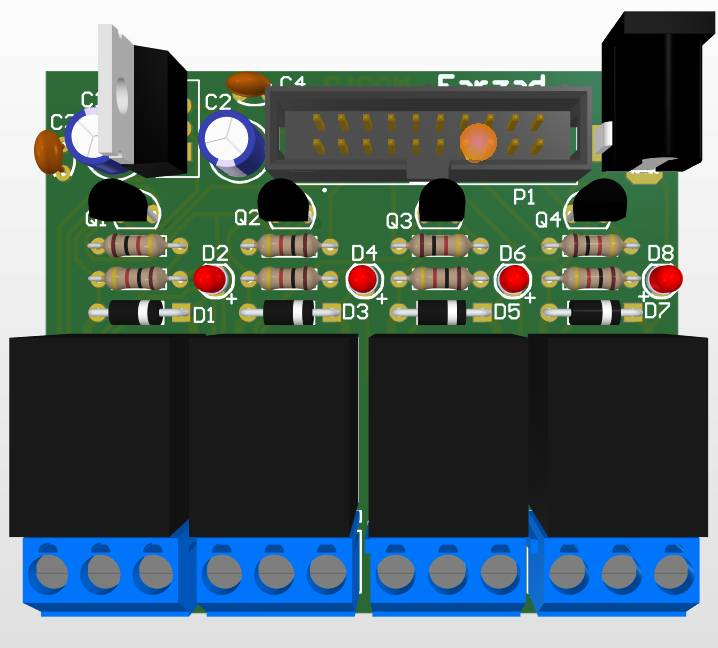
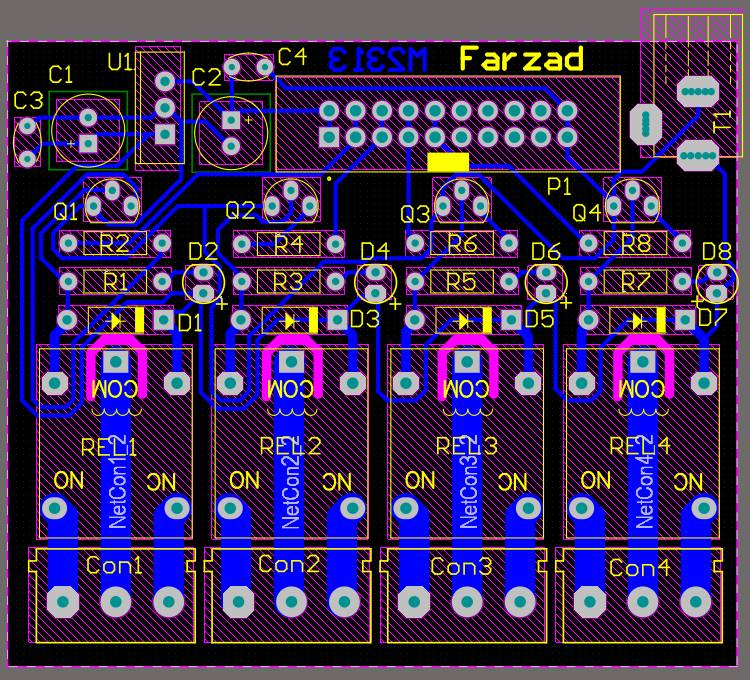
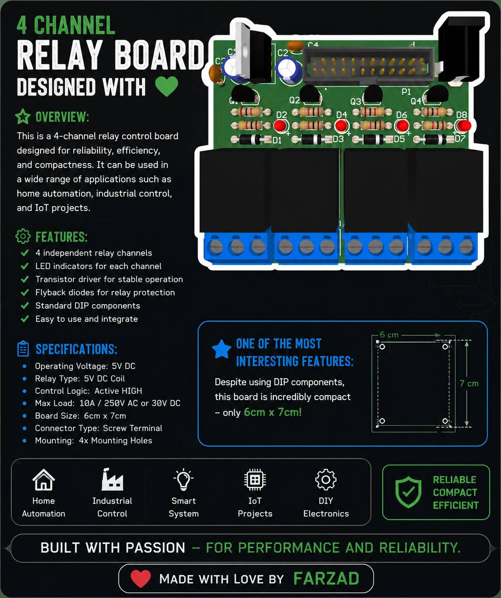

<h2>🔌 4-Channel Relay Board</h2>

I'm excited to share one of my latest PCB designs — a custom 4-Channel Relay Board built using through-hole (DIP) components. ⚡

The main goal of this project was to create a reliable, easy-to-assemble, and compact relay control board while keeping the layout clean and practical. Every section of the PCB was carefully arranged to optimize routing and improve maintainability.

📏 One of the things I'm most proud of is the board size. Despite using DIP components, I managed to keep the entire PCB at just 6 × 7 cm, making it both space-efficient and hobbyist-friendly.

This board is suitable for controlling multiple AC or DC loads and can easily be integrated into embedded systems, automation projects, IoT devices, and industrial control applications. 🚀

Designing PCBs is always a great opportunity to improve routing skills, component placement, and overall hardware design experience. Looking forward to building even more advanced projects! 💻⚙️

<table align="center">
<tr>
<td></td>
<td></td>

</tr>
</table> 

note : you can use this board with my AVR_PCB repo to test it right here !😄

<h3>❤️ Made with love by Farzad.</h3>
